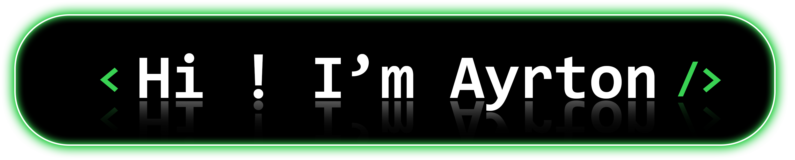

### Hi there 👋 My Name is Ayrton and I am a computer engineering student
- 🔭 I’m a freelancer in my design startup
- 🌱 I’m currently learning Node.js & React.js
- 👯 I’m looking to collaborate on all kinds of projects.
- 💬 I’m interested in learning mobile development

---
My Contact
https://www.linkedin.com/in/ayrton-diaz-75b5ba235/
---

---
<H3>My Skills<H3>  
  

  

  
---
<H3>DataBases<H3>  

  
---
<H3>Desing Skills<H3>  

  
---
<H3>Tools<H3>  

  
---
<H3>My Knowledge<H3>  

---

<H3>My Stats<H3>

  <a href="https://github.com/ayrtondiaz">
  
  

---
