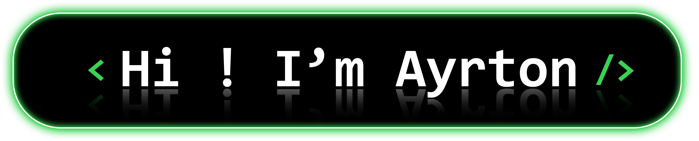

### Hi there 👋 My name is Ayrton and I am a Computer Engineer
- 🎓 Computer Engineer (UCASAL, 2025) focused on Data Analytics, AI and fullstack development
- 👨‍🏫 Higher-education professor of Programming II and Professional Practice II
- 🔭 I build ETL pipelines, Power BI dashboards and AI agents with n8n + MCP
- 🌱 I’m currently learning AWS, Apache Airflow, LangChain & LangGraph
- 👯 I’m looking to collaborate on all kinds of projects

My Contact

  

---
### Data & AI

  

  
  
  
  
  
  
  
  

---
### Web Development

  

---
### Databases

  

---
### Tools

  

---
### Design Skills

  

---
### Also worked with

  

---

### My Stats

  <a href="https://github.com/ayrtondiaz">
  
  

<picture>
  <source media="(prefers-color-scheme: dark)" srcset="https://raw.githubusercontent.com/ayrtondiaz/ayrtondiaz/output/github-contribution-grid-snake-dark.svg" />
  <source media="(prefers-color-scheme: light)" srcset="https://raw.githubusercontent.com/ayrtondiaz/ayrtondiaz/output/github-contribution-grid-snake.svg" />
  
</picture>

---
